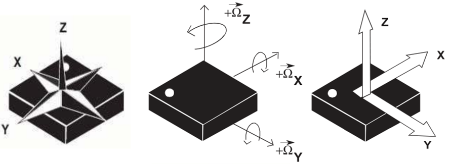

# IMU Sensor Fusion

Complementary-filter sensor fusion code for combining accelerometer, magnetometer, and rate-gyroscope data into a single stable estimate of orientation.

This code is currently adapted for the LSM9DS1 IMU but should be trivial to adapt to other sensors.

## Axis Orientation

*Source: https://learn.sparkfun.com/tutorials/lsm9ds1-breakout-hookup-guide*

*Note: Pay attentation to the IC's polarity-marking dot (the magnetometer axis are rotated).*

## Usage example

~~~ C++
#include "imu_orientation.h"
#include <iostream>
#include <chrono>
#include <unistd.h>

int main(int argc, char** argv)
{
    IMU_Orientation imu;
    int count = 10;
    auto then = std::chrono::steady_clock::now();

    while (count--) {
        usleep(1000);

        auto now = std::chrono::steady_clock::now();
        std::chrono::duration<double> elapsed = then - now;
        then = now;

        imu.setAccelerometerValues(0, 1, 0);
        imu.setGyroscopeRadianValues(0, 0, 0, elapsed.count());
        imu.setMagnetometerValues(0, 1, 2);

        imu.update();

        // print the estimated quaternion
        std::cout << "Quaternion: "
                  << imu.quaternion.w << ", "
                  << imu.quaternion.x << ", "
                  << imu.quaternion.y << ", "
                  << imu.quaternion.z << std::endl;

        // print the estimated Euler angles
        std::cout << "Euler angles: "
                  << imu.euler.tilt << ", "
                  << imu.euler.roll << ", "
                  << imu.euler.azimuth << ", "
                  << std::endl;
    }

    return 0;
}
~~~

## Compile Parameters

By default the algorithm uses doubles for all the calculations. If you wish to use floats, define ``SENSOR_FUSION_FLOATS`` before including library header file. See example below.

~~~ C++
#define SENSOR_FUSION_FLOATS
#include "imu_orientation.h"
~~~

For platformio you can add ``-DSENSOR_FUSION_FLOATS`` as a build flag in your platformio.ini file.